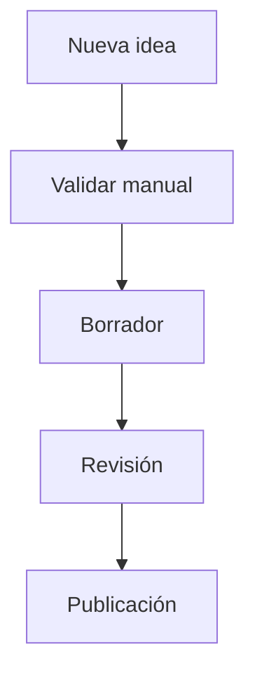

# MDO-04 · Guía para Colaboradores y Estándares de Documentación

**Código:** MDO-04 · Sprint 13.4 · **Entregado**

> Una documentación excelente no depende de escribir mucho. Depende de escribir de forma **consistente, reutilizable y alineada** con la arquitectura documental de Roustix.

**Toda la operación. Una sola plataforma.**

**Prerequisitos:** [MDO-01 · Filosofía](01-introduccion-portal.md) · [MDO-02 · Arquitectura](02-arquitectura-documentacion.md) · [MDO-03 · Uso del Portal](03-guia-usuarios.md)

---

## Objetivo del capítulo

Definir las **reglas oficiales** para cualquier persona que escriba, edite o mantenga documentación de Roustix.

### Aplica para

| Audiencia |
|-----------|
| Equipo de producto · Desarrollo · QA |
| Comercial · Marketing · Partners |
| Colaboradores externos |

Este documento garantiza que toda la documentación mantenga un **único estándar**.

---

## 1 · Filosofía

La documentación **es parte del producto**.

Por lo tanto debe cumplir los mismos principios que el software:

- Claridad
- Consistencia
- Mantenibilidad
- Escalabilidad
- Versionado

> No se escribe pensando únicamente en el lector actual.  
> Se escribe pensando en el **Roustix de los próximos años**.

---

## 2 · Principios editoriales

Todo documento debe cumplir estos principios.

| Principio | Significado |
|-----------|-------------|
| **Claridad** | Explicar primero el concepto, luego el detalle |
| **Modularidad** | Cada documento resuelve un tema |
| **Reutilización** | Evitar copiar contenido entre manuales |
| **Consistencia** | Mantener la misma terminología |
| **Honestidad** | Diferenciar producción, diseño y roadmap |
| **Evolución** | Permitir crecer sin romper la estructura |

---

## 3 · Qué manual editar

Antes de escribir contenido nuevo debe responderse: **¿En qué manual pertenece?**

| Si trata de… | Manual |
|--------------|--------|
| Producto | [MRG](/mrg/) |
| Arquitectura | [MPA](/mpa/) |
| API | [MAG](/mag/) |
| SDK | [MSD](/msd/) |
| UX | [MUX](/mux/) |
| Diseño | [MDL](/mdl/) |
| Comercial | [MCM](/mcm/) |
| Marketing | [MKT](/mkt/) |
| Documentación | [MDO](/mdo/) |

> **Nunca duplicar información.** Siempre enlazar al manual correspondiente.

→ Reglas de dominio: [MDO-02 §3](02-arquitectura-documentacion.md#3--qué-manual-editar)

---

## 4 · Estructura oficial de un capítulo

Todos los capítulos siguen la **misma plantilla**.

1. **Título**
2. **Código**
3. **Estado**
4. **Objetivo**
5. **Secciones principales**
6. **Relaciones**
7. **Exit Criteria**
8. **Estado**
9. **Navegación** (capítulo anterior · índice · siguiente)

Esto permite que cualquier lector encuentre rápidamente la información.

**Plantilla mínima:**

```markdown
# CÓDIGO · Título

**Código:** XXX-NN · Sprint X.N · **Estado**

**Prerequisitos:** …

---

## Objetivo del capítulo

…

---

## 1 · …

---

## Relación con otros documentos

| Documento | Rol |
|-----------|-----|

---

## Exit Criteria

- [ ] …

---

← Capítulo anterior · Índice · Capítulo siguiente →
```

---

## 5 · Estados permitidos

Todo documento debe indicar claramente su **estado**.

| Estado | Significado |
|--------|-------------|
| 📋 **Planificado** | Diseñado · aún no implementado |
| 🟡 **En desarrollo** | Borrador · disponible parcialmente |
| 🔄 **Revisión técnica** | Producto valida exactitud funcional |
| 📝 **Revisión editorial** | Documentación valida formato y tono |
| ✅ **Publicado** | Oficial · referencia válida en portal |
| 📦 **Archivado** | Histórico · solo lectura |
| ❌ **Obsoleto** | No utilizar |

> **Nunca ocultar el estado real.**  
> Ciclo completo y matriz de madurez: [MDO-05 §5 · §14](05-versionado-releases.md#5--ciclo-de-vida-de-un-documento)

---

## 6 · Terminología oficial

Siempre utilizar el **vocabulario oficial** de Roustix.

| Correcto | Evitar |
|----------|--------|
| Tenant | Empresa *(como sinónimo técnico)* |
| Plataforma | Sistema |
| Módulo | Programa |
| Dashboard | Pantalla principal |
| Roadmap | «Próximamente» *(sin contexto)* |
| Sprint | Versión |
| Portal | Página web *(genérico)* |

Cuando exista una definición oficial en **MRG** o **MPA**, utilizar esa terminología.

→ Marketing: [MKT-01 · Terminología](/mkt/chapters/01-identidad-mensajes-marca.md) · Glosario: [MDO-02 §9](02-arquitectura-documentacion.md#9--glosario-común)

---

## 7 · Convenciones de escritura

### Encabezados

Utilizar jerarquía consistente:

```markdown
# Capítulo
## Sección
### Subsección
```

No utilizar niveles innecesarios.

### Tablas

Preferir tablas para:

- Comparaciones
- Matrices
- Estados
- Responsabilidades
- Checklist

### Listas

Usar listas únicamente cuando representen **procesos** o **elementos relacionados**.

No convertir todo el documento en listas.

### Código

Todo código debe ir en **bloques Markdown**:

````markdown
```python
...
```
````

Nunca mezclar código con texto corrido.

### Diagramas

Preferir **Mermaid** cuando sea posible.



---

## 8 · Referencias cruzadas

Toda referencia debe apuntar al **documento oficial**.

| ✅ Correcto | ❌ Incorrecto |
|-------------|---------------|
| → [MRG-07 Administración](/mrg/) | «Ver otro documento» |
| → [MAG-02 Autenticación](/mag/) | Enlace sin destino |
| → [MCM-04 Planes](/mcm/) | Duplicar el contenido aquí |

Toda referencia debe permitir **localizar fácilmente** el contenido.

→ Matriz: [CROSS-REFERENCES.md](/docs/CROSS-REFERENCES.md)

---

## 9 · Qué evitar

No se debe:

- Duplicar información
- Copiar capítulos completos
- Inventar nombres de módulos
- Mezclar roadmap con producción
- Utilizar lenguaje ambiguo
- Escribir «próximamente» sin indicar estado

---

## 10 · Flujo de contribución

Antes de publicar un cambio:

```
Nueva idea
    ↓
Validar manual correcto
    ↓
Crear borrador
    ↓
Revisión técnica
    ↓
Revisión editorial
    ↓
Aprobación
    ↓
Publicación
    ↓
Versionado
```

---

## 11 · Revisión de calidad

Antes de aprobar un documento verificar:

### Contenido

- [ ] Objetivo claro
- [ ] Estructura oficial
- [ ] Sin duplicados
- [ ] Terminología consistente
- [ ] Referencias correctas

### Técnica

- [ ] Enlaces válidos
- [ ] Rutas existentes
- [ ] Diagramas correctos
- [ ] Tablas consistentes

### Editorial

- [ ] Ortografía
- [ ] Tono Roustix
- [ ] Formato uniforme
- [ ] Estado actualizado

---

## 12 · Versionado

Cada modificación importante debe **registrarse**.

| Versión | Cambio |
|---------|--------|
| 1.0 | Documento inicial |
| 1.1 | Nuevos ejemplos |
| 1.2 | Actualización Sprint 14 |

> **No modificar silenciosamente** documentos oficiales.

→ Política: [VERSIONING.md](/docs/VERSIONING.md) · Changelog del manual: `{dominio}/changelog.md`

---

## 13 · Responsabilidades

| Rol | Responsabilidad |
|-----|-----------------|
| **Producto** | Exactitud funcional |
| **Arquitectura** | Consistencia técnica |
| **Comercial** | Mensaje MCM |
| **Marketing** | Copy MKT |
| **QA** | Validación |
| **Documentación** | Calidad editorial |

---

## 14 · Relación con el resto de la suite

| Manual | Relación |
|--------|----------|
| [MRG](/mrg/) | Fuente funcional |
| [MPA](/mpa/) | Arquitectura |
| [MAG](/mag/) | API |
| [MSD](/msd/) | Desarrollo |
| [MDL](/mdl/) | Diseño |
| [MUX](/mux/) | Experiencia |
| [MCM](/mcm/) | Comercial |
| [MKT](/mkt/) | Marketing |
| [MDO](/mdo/) | Gobierno documental |

---

## Exit Criteria

- [x] Existe una guía única para colaboradores
- [x] Se definieron estándares editoriales
- [x] Se documentó el flujo de contribución
- [x] Se establecieron reglas de calidad
- [x] Se alineó la documentación con toda la suite Roustix

---

## Filosofía del capítulo

Una buena documentación **no depende del autor**.

Depende de un **estándar** que permita que cualquier colaborador escriba con la misma calidad, estructura y lenguaje, haciendo que Roustix evolucione de forma ordenada.

---

## Estado

| Aspecto | Estado |
|---------|--------|
| Estándares editoriales | ✅ Definidos |
| Flujo de colaboración | ✅ Documentado |
| Gobierno documental | ✅ Activo |
| Base para futuros colaboradores | ✅ Disponible |
| MDO-04 | ✅ Entregado |
| Sprint 13 | 🚧 En progreso |

---

← [MDO-03](03-guia-usuarios.md) · [Índice MDO](/mdo/) · [MDO-05](05-versionado-releases.md) →
